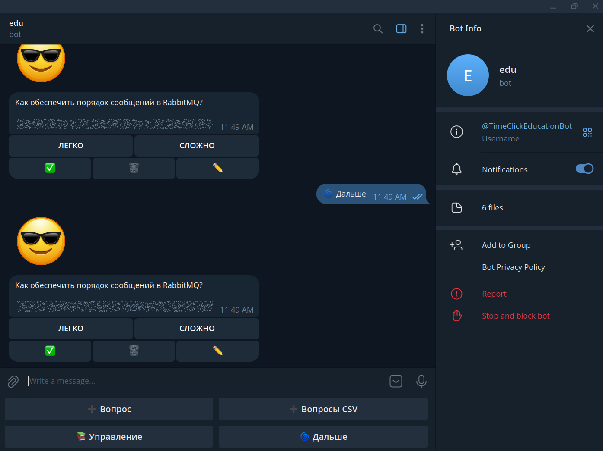

@TimeClickEducationBot - концепция ANKI 

# Кривая забывания Эббингауза и её применение

Кривая забывания, открытая Германом Эббингаузом, показывает, как быстро забывается информация без повторения. Согласно исследованиям, уже через час после изучения материала в памяти остаётся только ~44% информации, а через неделю — менее 25%.

Код реализует систему интервальных повторений, основанную на этой концепции.

## Логика повторений

1. **При правильном ответе**:
    - Увеличивается счётчик правильных ответов (`TotalCorrect`)
    - Увеличивается серия правильных ответов (`TotalSerial`)
    - Устанавливается новое время повторения в зависимости от серии правильных ответов:
        - 0: повтор через 10 минут
        - 1: через 1 час
        - 2: через 2 часа
        - 3: через 4 часа
        - 4: через 12 часов
        - 5: через 3 дня
        - 6 и более: через 7 дней

2. **При неправильном ответе**:
    - Увеличивается счётчик ошибок (`TotalWrong`)
    - Сбрасывается серия правильных ответов (`TotalSerial = 0`)
    - Повторение назначается через 10 минут

## Связь с классической кривой забывания

Алгоритм учитывает основные принципы эффективного запоминания:
- Первые повторения идут с короткими интервалами (10 мин, 1 час) — это соответствует "критическому" периоду быстрого забывания
- По мере успешных повторений интервалы увеличиваются (дни, недели) — это соответствует фазе долговременной памяти
- Ошибка возвращает к началу цикла, так как материал требует повторного закрепления

Такой подход позволяет оптимизировать процесс запоминания, повторяя информацию именно тогда, когда она начинает забываться, что подтверждено многочисленными исследованиями в области когнитивной психологии.
